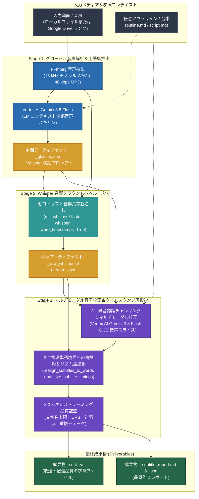

# Subtitle Craft — 放送品質 AI 字幕生成＆校正スイート

[English (en)](README.md) | [繁體中文 (zh-TW)](README.zh-TW.md) | [简体中文 (zh-CN)](README.zh-CN.md) | [日本語 (ja)](README.ja.md) | [한국어 (ko)](README.ko.md)

---

> [!IMPORTANT]
> **Google Antigravity ネイティブプラグイン＆ワークフロースイート**  
> 本ツールキットは、**Google Antigravity**（**Vertex AI Gemini 3.8 Flash** および **Whisper 単語タイムスタンプ** 搭載）向けのスタンドアロン 3 ステージ YouTube / Netflix 字幕生成＆品質監査スイートです。

---

**Subtitle Craft** は、ローカルまたは Google Drive 上の動画・音声ファイルから、ミリ秒単位で正確に同期し専門用語を統一した字幕（`.srt` および `.vtt`）を生成します。Antigravity チャット画面で自然言語で指示するだけで、字幕生成から品質監査までを自動実行します。

---

## インストールと Google Cloud セットアップ (`setup.sh`)

本プロジェクトは [Agent Plugins 1.0](https://agent-plugins.org/) に準拠し、**Google Cloud Vertex AI (ADC)** と **Cloud Storage (GCS)** 上で動作します（API キー管理不要）。

```bash
# 1. グローバル Antigravity Plugin としてクローン
git clone https://github.com/sylphlin/subtitle-craft.git ~/.gemini/config/plugins/subtitle-craft

# 2. 依存パッケージのインストールと ADC 認証
brew install ffmpeg
pip install -r requirements.txt
gcloud auth application-default login

# 3. setup.sh を実行して GCS バケット、2 階層ライフサイクル（raw: 2 日、成果物: 15 日）、IAM、.env を構成
chmod +x setup.sh
./setup.sh --project YOUR_GCP_PROJECT_ID
```

### ディレクトリ構造（Agent Plugins 1.0 準拠）
- **SSOT 実体ディレクトリ**：`skills/subtitle-craft/`（`SKILL.md`、`scripts/`、`assets/` を格納）を単一の信頼できる情報源とし、ルートの `SKILL.md`、`scripts`、`assets` は POSIX シンボリックリンクとして構成されています。
- **2 層 `AGENTS.md` 構成**：ルートの `AGENTS.md` は開発・エンジニアリング規約（Part I & Part II）を定義し、`rules/AGENTS.md` はプラグインに同梱される AI クライアント実行時ルール（`<PLUGIN_ROOT>` からの直接 CLI 実行、読み取り専用、Fail-Fast）を定義します。

---

## 3 ステージ・ゴールデン字幕パイプラインアーキテクチャ



---

## 利用シナリオと Agent プロンプト例 (User Scenarios & Agent Prompts)

### シナリオ 1：標準の YouTube・Netflix 字幕生成
- **ユースケース**：動画・音声ファイルからミリ秒精度の `.srt` / `.vtt` 字幕を生成し、同音異義語や専門用語を校正します。
- **Agent プロンプト例**：
  > *「`output/final_cut.mp4` の日本語 YouTube 字幕を生成して、専門用語や同音異義語を校正して。」*
- **生成される成果物**：
  1. `final_cut.srt` および `final_cut.vtt`（放送・配信基準に準拠した字幕ファイル）。
  2. `final_cut_glossary.md`（検証済み専門用語・話者一覧）。
  3. `final_cut_subtitle_report.md` および `final_cut_subtitle_report.json`（8 次元品質監査レポート）。

### シナリオ 2：インタビュー概要や台本を参照した用語固定字幕生成
- **ユースケース**：人名リスト、ブランド表記、または台本を指定し、動画全体で用語の表記揺れをゼロにします。
- **Agent プロンプト例**：
  > *「`outline.md` と `script.md` を用語リファレンスとして使い、`interview.mp4` の字幕を生成して。」*
- **生成される成果物**：
  1. `interview.srt` および `interview.vtt`（台本・概要の用語に完全準拠した字幕）。
  2. `interview_glossary.md`、`interview_subtitle_report.md`、`interview_subtitle_report.json`。

### シナリオ 3：Google Drive 共有リンクからの直接字幕生成
- **ユースケース**：Google Drive 上の動画・音声リンクを直接指定し、MD5 キャッシュ検証付きでダウンロードから字幕生成まで自動実行します。
- **Agent プロンプト例**：
  > *「この Google Drive 動画 `https://drive.google.com/file/d/FILE_ID/view` の日本語字幕と品質監査レポートを作成して。」*
- **生成される成果物**：
  1. `<動画名>.srt` および `<動画名>.vtt`。
  2. `<動画名>_glossary.md`、`<動画名>_subtitle_report.md`、`<動画名>_subtitle_report.json`。

---

## 3 ステージ技術概要

1. **Stage 1（Vertex AI 1M グローバル用語集＆Whisper 初期プロンプト抽出）**：**Gemini 3.8 Flash** で音声全体をスキャンし、`<basename>_glossary.md` と Whisper 初期プロンプトを生成します。
2. **Stage 2（Whisper 単語レベル音響グラウンドトゥルース）**：`mlx-whisper` または `faster-whisper`（`word_timestamps=True`）でミリ秒単位の単語境界を抽出し、`<basename>_words.json` にキャッシュします。
3. **Stage 3（無音認識チャンキング＆マルチモーダル音声校正＋8 次元品質監査）**：自然な息継ぎ（$\ge 0.4\text{s}$）で分割し、音声スライスと用語集を照合して同音異義語を校正した後、単語境界へタイムスタンプを再投影して `<basename>_subtitle_report.md` と `.json` を出力します。

---

## GCS 2 階層ライフサイクルポリシー (`gs://subtitle-craft-${PROJECT_ID}`)

| GCS パス接頭辞 (`matchesPrefix`) | 保存対象 | 保持期間 (`age`) | クリーンアップ動作 |
| :--- | :--- | :--- | :--- |
| **`raw/audio_chunks/`** | Stage 3 音声チャンク | **推論直後に即時削除** | 各チャンク完了後に Python `finally` ブロックで即時削除します。 |
| **`raw/`** | 一時エピソード音声 | **2 日間 (`age: 2`)** | SHA-256 キャッシュ再利用のため 2 日間保持し、自動削除します。 |
| **`output/`**、**`deliverables/`** | SRT/VTT 字幕、監査レポート | **15 日間 (`age: 15`)** | チーム確認用に 15 日間保持した後、自動削除します。 |

---

## ライセンス (License)

本プロジェクトは [MIT License](LICENSE) の下で提供されています。
