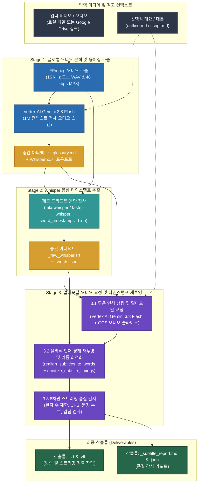

# Subtitle Craft — 방송급 AI 자막 생성 및 교정 스위트

[English (en)](README.md) | [繁體中文 (zh-TW)](README.zh-TW.md) | [简体中文 (zh-CN)](README.zh-CN.md) | [日本語 (ja)](README.ja.md) | [한국어 (ko)](README.ko.md)

---

> [!IMPORTANT]
> **Google Antigravity 네이티브 플러그인 및 워크플로 스위트**  
> 본 툴킷은 **Google Antigravity**(**Vertex AI Gemini 3.8 Flash** 및 **Whisper 단어 타임스탬프** 기반)를 위한 독립형 3단계 YouTube / Netflix 자막 생성 및 품질 감사 스위트입니다.

---

**Subtitle Craft**는 로컬 또는 Google Drive의 비디오 및 오디오 파일에서 밀리초 단위로 정확하게 정렬되고 전문 용어가 통일된 자막(`.srt` 및 `.vtt`)을 생성합니다. Antigravity 채팅 창에서 자연어로 지시하면 자막 생성부터 품질 감사까지 전체 워크플로를 자동으로 수행합니다.

---

## 설치 및 Google Cloud 설정 (`setup.sh`)

본 프로젝트는 [Agent Plugins 1.0](https://agent-plugins.org/) 표준을 준수하며 **Google Cloud Vertex AI (ADC)** 및 **Cloud Storage (GCS)** 기반으로 동작합니다.

```bash
# 1a. 글로벌 Antigravity Plugin으로 클론 (권장)
git clone https://github.com/sylphlin/subtitle-craft.git ~/.gemini/config/plugins/subtitle-craft

# 1b. 레거시 단일 Skill 디렉터리 설치 (선택 사항: 내부 skills/subtitle-craft 심볼릭 링크 연결)
ln -s ~/.gemini/config/plugins/subtitle-craft/skills/subtitle-craft ~/.gemini/config/skills/subtitle-craft

# 2. 의존성 설치 및 ADC 인증
brew install ffmpeg
pip install -r requirements.txt
gcloud auth application-default login

# 3. setup.sh 실행하여 GCS 버킷, 2단계 수명 주기(raw: 2일, 결과물: 15일), IAM 및 .env 설정
chmod +x setup.sh
./setup.sh --project YOUR_GCP_PROJECT_ID
```

### 디렉터리 구조 (Agent Plugins 1.0 표준)
- **SSOT 실제 디렉터리**: `skills/subtitle-craft/`(`SKILL.md`, `scripts/`, `assets/` 포함)를 단일 진실 공급원(SSOT)으로 사용합니다.
- **2계층 `AGENTS.md` 구성**: 루트 `AGENTS.md`는 워크스페이스 및 개발 표준(Part I & Part II)을 정의하고, 플러그인 내부의 `rules/AGENTS.md`는 AI 클라이언트 실행 규칙(`<PLUGIN_ROOT>` 직접 CLI 호출, 읽기 전용, Fail-Fast)을 정의합니다.

---

## 3단계 골든 자막 파이프라인 아키텍처



---

## Antigravity 사용 방법 및 시나리오 (Usage & Scenarios)

Antigravity에서는 다음 두 가지 방식으로 실행할 수 있습니다:
1. **간결한 명령어 (`/skill` + `@파일`)**: `/subtitle-craft`를 선택하고 `@`로 미디어 파일, 개요 또는 대본만 지정하면 즉시 실행됩니다.
2. **자연어 프롬프트**: 일상적인 문장으로 요청 사항을 입력하고 `@` 파일이나 클라우드 링크를 첨부하면 자동으로 플러그인이 호출됩니다.

### 시나리오 1: 표준 YouTube 및 Netflix 자막 생성
- **사용 사례**: 비디오 또는 오디오 파일에서 밀리초 단위로 정렬된 `.srt` 및 `.vtt` 자막을 생성하고 동음이의어와 전문 용어를 교정합니다.
- **방식 A (`/ + @` 간결한 명령어)**:
  ```text
  /subtitle-craft 파일: @final_cut.mp4
  ```
- **방식 B (자연어 프롬프트)**:
  ```text
  @final_cut.mp4의 한국어 YouTube 자막을 생성하고 전문 용어와 동음이의어를 교정해 줘.
  ```
- **산출물** (`<입력_폴더>/output/`에 자동 저장):
  1. `final_cut.srt` 및 `final_cut.vtt` (방송 및 스트리밍 호흡에 맞춘 자막 파일).
  2. `final_cut_glossary.md` (검증된 전문 용어 및 화자 목록).
  3. `final_cut_subtitle_report.md` 및 `final_cut_subtitle_report.json` (8차원 스트리밍 품질 감사 리포트).

### 시나리오 2: 인터뷰 개요 또는 대본을 활용한 용어 고정 자막 생성
- **사용 사례**: 출연자 이름, 브랜드 표기 또는 녹음 대본을 함께 제공하여 전체 영상의 용어 일관성을 100% 보장합니다.
- **방식 A (`/ + @` 간결한 명령어)**:
  ```text
  /subtitle-craft 파일: @interview.mp4, 개요: @outline.md, 대본: @script.md
  ```
- **방식 B (자연어 프롬프트)**:
  ```text
  @outline.md와 @script.md를 용어 참고 자료로 사용하여 @interview.mp4의 자막을 생성해 줘.
  ```
- **산출물**:
  1. `interview.srt` 및 `interview.vtt` (개요 및 대본 용어가 반영된 자막).
  2. `interview_glossary.md`, `interview_subtitle_report.md`, `interview_subtitle_report.json`.

### 시나리오 3: Google Drive 공유 링크에서 직접 자막 생성
- **사용 사례**: Google Drive 비디오 또는 오디오 링크를 직접 전달하여 원격 MD5 캐시 검증과 함께 자막을 생성합니다.
- **방식 A (`/ + @` 간결한 명령어)**:
  ```text
  /subtitle-craft 링크: https://drive.google.com/file/d/FILE_ID/view, 언어: 한국어
  ```
- **방식 B (자연어 프롬프트)**:
  ```text
  이 Google Drive 영상 https://drive.google.com/file/d/FILE_ID/view 의 한국어 자막과 품질 감사 리포트를 생성해 줘.
  ```
- **산출물**:
  1. `<영상_이름>.srt` 및 `<영상_이름>.vtt`.
  2. `<영상_이름>_glossary.md`, `<영상_이름>_subtitle_report.md`, `<영상_이름>_subtitle_report.json`.

---

## 3단계 핵심 기술 개요 (v2.0 아키텍처)

- **출력 디렉터리 자동 분리 (`<input_dir>/output/`)**: 모든 산출물과 캐시 파일은 기본적으로 `<input_dir>/output/` 하위 폴더에 저장됩니다(입력 경로가 이미 `output/`인 경우 중첩 없이 그대로 재사용합니다).
1. **Stage 1 (Vertex AI 1M 글로벌 용어집 및 Whisper 초기 프롬프트 — 엄격한 Fail-Fast)**: **Gemini 3.8 Flash**로 전체 오디오를 스캔하여 `<basename>_glossary.md`와 Whisper 초기 프롬프트를 추출하며, 클라우드 오류 발생 시 즉시 종료 코드 `1`로 중단합니다.
2. **Stage 2 (Whisper 단어 수준 음향 타임스탬프 — 기본값 `small` 모델)**: 기본 Whisper `small` 모델로 `mlx-whisper` 또는 `faster-whisper`(`word_timestamps=True`)를 실행하여 고정밀 단어 경계를 `<basename>_words.json`에 캐시합니다.
3. **Stage 3 (무음 인식 청킹, 비연쇄 재투영 및 `agent_verdict` 품질 게이트)**: 자연스러운 호흡 구간($\ge 0.4\text{s}$)에서 분할하여 동음이의어를 교정한 뒤, 양방향 탄성 탐색 윈도우(`cur_char_idx - 15`), 보수적 폴백 진행(`+ L` 글자), 재동기화 앵커 및 `source_bounds` 경계 제한을 통해 연쇄적인 타임스탬프 밀림 현상을 방지합니다(발화 종료 후 $+0.4\text{s}$ 읽기 버퍼를 유지하면서 `media_duration + 0.4s`로 상한 보호). `<basename>_subtitle_report.json` 최상위에 `agent_verdict`를 기록하며 품질 게이트 미달 시 Agent가 최대 1회 자동 복구 재시도를 수행합니다.

---

## GCS 2단계 수명 주기 정책 (`gs://subtitle-craft-${PROJECT_ID}`)

| GCS 경로 접두사 (`matchesPrefix`) | 저장 객체 | 보관 기간 (`age`) | 정리 방식 |
| :--- | :--- | :--- | :--- |
| **`raw/audio_chunks/`** | Stage 3 오디오 청크 | **추론 직후 즉시 삭제** | 각 청크 완료 후 Python `finally` 블록에서 즉시 삭제합니다. |
| **`raw/`** | 스테이징된 에피소드 오디오 | **2일 (`age: 2`)** | SHA-256 캐시 재사용을 위해 2일간 보관 후 자동 삭제합니다. |
| **`output/`**, **`deliverables/`** | SRT/VTT 자막 및 감사 리포트 | **15일 (`age: 15`)** | 팀 검토를 위해 15일간 보관한 후 자동 삭제합니다. |

---

## 라이선스 (License)

이 프로젝트는 [MIT License](LICENSE)에 따라 라이선스가 부여됩니다.
