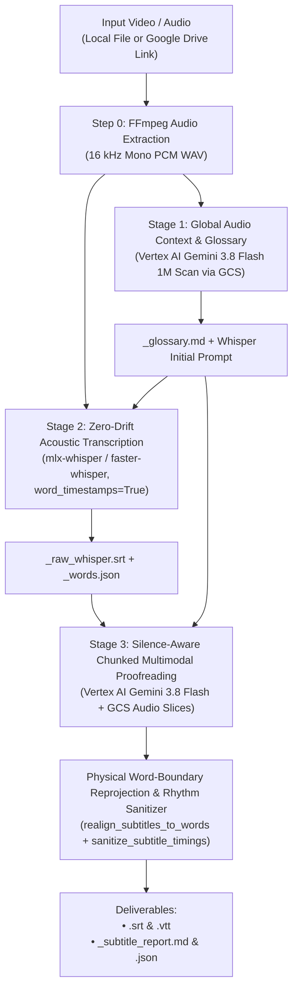

# Subtitle Craft — Broadcast-Grade AI Subtitle Suite

[English (en)](README.md) | [繁體中文 (zh-TW)](README.zh-TW.md) | [简体中文 (zh-CN)](README.zh-CN.md) | [日本語 (ja)](README.ja.md) | [한국어 (ko)](README.ko.md)

---

> [!IMPORTANT]
> **Google Antigravity Native Plugin & Workflow Suite**  
> This toolkit provides a standalone 3-stage YouTube and Netflix subtitle generation workflow for **Google Antigravity** (powered by **Vertex AI Gemini 3.8 Flash** and **Whisper Word-Level Acoustic Ground Truth**).

---

**Subtitle Craft** generates millisecond-accurate, terminology-verified subtitles (`.srt` and `.vtt`) from local or Google Drive video and audio files. Instruct the Antigravity Agent in natural language or run the CLI script directly.

---

## Installation & Google Cloud Setup (`setup.sh`)

This project complies with [Agent Plugins 1.0](https://agent-plugins.org/) and runs on **Google Cloud Vertex AI (ADC)** and **Cloud Storage (GCS)** with zero API key files.

### 1. Install as an Antigravity Plugin or Skill

- **Global Plugin (Recommended)**:
  ```bash
  git clone https://github.com/sylphlin/subtitle-craft.git ~/.gemini/config/plugins/subtitle-craft
  ```
- **Global Skill**:
  ```bash
  git clone https://github.com/sylphlin/subtitle-craft.git ~/.gemini/config/skills/subtitle-craft
  ```

### 2. Install Dependencies and Provision Cloud Resources (`setup.sh`)

```bash
# 1. Install FFmpeg and Python packages
brew install ffmpeg
pip install -r requirements.txt

# 2. Authenticate Application Default Credentials (ADC)
gcloud auth application-default login

# 3. Provision GCS bucket, two-tier lifecycle rules (raw: 2d, deliverables: 15d), IAM, and .env
chmod +x setup.sh
./setup.sh --project YOUR_GCP_PROJECT_ID
```

### Directory Structure (Agent Plugins 1.0 Specification)
```text
subtitle-craft/
├── plugin.json                                     # Agent Plugins 1.0 manifest
├── rules/
│   └── AGENTS.md                                   # Packaged client execution invariants (<PLUGIN_ROOT> direct CLI & fail-fast)
├── skills/
│   └── subtitle-craft/                             # Canonical Skill Bundle (Single Source of Truth)
│       ├── SKILL.md                                # Antigravity skill manifest and 3-step gated runbook
│       ├── scripts/                                # Canonical execution scripts & modules (SSOT)
│       │   ├── generate_subtitles.py               # 3-stage subtitle pipeline & 8-dimension quality audit
│       │   └── modules/                            # Vertex AI (llm_client), GCS/Drive (gcp_client), and progress modules
│       └── assets/                                 # Canonical multi-locale prompt templates (SSOT)
│           └── subtitle_proofread_template.*.md    # Language-specific YouTube/Netflix subtitle proofreading rules
├── SKILL.md -> skills/subtitle-craft/SKILL.md      # Root POSIX symlink
├── scripts -> skills/subtitle-craft/scripts        # Root POSIX symlink for CLI & test compatibility
├── assets -> skills/subtitle-craft/assets          # Root POSIX symlink for prompt resolution
├── subtitle_craft.py                               # Root CLI entrypoint
├── AGENTS.md                                       # Workspace & engineering development rules (Part I & Part II)
├── setup.sh                                        # Native gcloud setup script (GCS, Lifecycle, IAM, .env)
├── pyproject.toml                                  # Python package metadata and CLI entrypoint
├── requirements.txt                                # Runtime dependencies
├── .env.example                                    # Vertex AI (ADC) and GCS configuration template
└── tests/                                          # Offline unit test suite
```

---

## End-to-End 3-Stage Golden Subtitle Architecture



---

## User Scenarios & Agent Prompts

### Scenario 1: Standard YouTube & Netflix Subtitles
- **Use Case**: Generate millisecond-accurate `.srt` and `.vtt` subtitles with homophone and terminology proofreading.
- **Agent Prompt**:
  > *"Generate YouTube subtitles for `output/final_cut.mp4` and proofread technical terms."*
- **CLI Command**:
  ```bash
  python3 subtitle_craft.py -i output/final_cut.mp4 --language zh-TW
  ```

### Scenario 2: Subtitles Anchored with an Interview Outline or Script
- **Use Case**: Provide speaker names, brand spellings, or a recording script to guarantee 100% terminology consistency.
- **Agent Prompt**:
  > *"Generate subtitles for `interview.mp4` using `outline.md` as the terminology reference."*
- **CLI Command**:
  ```bash
  python3 subtitle_craft.py -i interview.mp4 --outline outline.md --script script.md --language zh-TW
  ```

### Scenario 3: Direct Subtitle Generation from a Google Drive Link
- **Use Case**: Download a video or audio file directly from Google Drive (with MD5 cache verification) and generate subtitles.
- **CLI Command**:
  ```bash
  python3 subtitle_craft.py -i "https://drive.google.com/file/d/FILE_ID/view" --language en
  ```

---

## Detailed Pipeline Stages

### Stage 1: Global Audio Context & Consistency Glossary
- Compresses the full episode audio to 48 kbps mono MP3, stages it to `gs://subtitle-craft-${PROJECT_ID}/raw/`, and scans the full recording with **Vertex AI Gemini 3.8 Flash** (`1M` token context).
- Produces `<basename>_glossary.md` and extracts a compact Whisper `initial_prompt` ($\le 145$ characters) tailored to the target language (`zh-TW`, `zh-CN`, `en`, `ja`, `ko`).

### Stage 2: Whisper Word-Level Acoustic Ground Truth
- Runs `mlx-whisper` (Apple Silicon Metal GPU / Neural Engine) or `faster-whisper` (`int8` multi-core CPU) with `word_timestamps=True`.
- Saves `<basename>_raw_whisper.srt` and `<basename>_words.json` so subsequent proofreading runs reuse the cached acoustic baseline.

### Stage 3: Silence-Aware Multimodal Proofreading & Acoustic Re-Projection
1. **Silence-Aware Semantic Chunking**: Splits SRT blocks at natural speech pauses ($\text{gap} \ge 0.4\text{s}$) to prevent mid-sentence cuts across chunk boundaries.
2. **Multimodal Audio-Text Proofreading**: Slices the corresponding audio segment for each chunk, stages it to `gs://<bucket>/raw/audio_chunks/`, proofreads against both the audio waveform and the Global Glossary, and deletes the remote chunk in a `finally` block.
3. **Physical Word-Boundary Re-Projection**: Maps proofread subtitle lines back onto Whisper's physical word-level character timeline (`realign_subtitles_to_words`) and applies broadcast rhythm sanitization (`180 ms` lead-in pre-roll, $+0.4\text{s}$ post-tail reading buffer, $<0.2\text{s}$ micro-gap bridging, $1.0\text{s}\text{–}6.0\text{s}$ duration bounds).
4. **8-Dimension Streaming Quality Audit**: Evaluates line length (`CJK <= 15`, `ko <= 16`, `Latin <= 42`), reading speed (CPS), trailing punctuation, bracket closure, Markdown cleanliness, acoustic lock rate, timing overlaps/micro-gaps, and prolonged silences ($\ge 10\text{s}$).

---

## Two-Tier GCS Bucket Lifecycle Policy (`gs://subtitle-craft-${PROJECT_ID}`)

| GCS Prefix (`matchesPrefix`) | Stored Objects | Retention (`age`) | Cleanup Mechanism |
| :--- | :--- | :--- | :--- |
| **`raw/audio_chunks/`** | Stage 3 audio slices | **Immediate** | Deleted in Python `finally` blocks immediately after each chunk completes. |
| **`raw/`** | Staged episode audio | **2 Days (`age: 2`)** | Retains SHA-256 cached staging media for 2 days, then deletes automatically. |
| **`output/`**, **`deliverables/`** | SRT/VTT subtitles and audit reports | **15 Days (`age: 15`)** | Retains deliverables for 15 days for team review before automatic deletion. |

---

## License

This project is licensed under the [MIT License](LICENSE).
