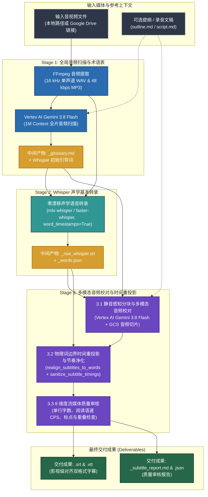

# Subtitle Craft — 影视级 AI 智能字幕生成与校对套件

[English (en)](README.md) | [繁體中文 (zh-TW)](README.zh-TW.md) | [简体中文 (zh-CN)](README.zh-CN.md) | [日本語 (ja)](README.ja.md) | [한국어 (ko)](README.ko.md)

---

> [!IMPORTANT]
> **Google Antigravity 原生技能与工作流套件**  
> 本工具集为 **Google Antigravity**（由 **Vertex AI Gemini 3.8 Flash** 与 **Whisper 毫秒级逐词时间戳** 驱动）打造独立的三阶段 YouTube / Netflix 字幕生成与质量审核工作流。

---

**Subtitle Craft** 支持将本地或 Google Drive 视频与音频文件转换为毫秒级精准对齐、专有名词统一的 `.srt` 与 `.vtt` 字幕。直接在 Antigravity 对话窗口使用自然语言下达指令，即可由 Agent 自动完成全流程字幕生成与质量审核。

---

## 安装与 Google Cloud 环境配置 (`setup.sh`)

本项目遵循 [Agent Plugins 1.0](https://agent-plugins.org/) 规范，完全基于 **Google Cloud Vertex AI (ADC)** 与 **Cloud Storage (GCS)** 运行，无需 API Key。

```bash
# 1a. 安装为全局 Antigravity Plugin（推荐）
git clone https://github.com/sylphlin/subtitle-craft.git ~/.gemini/config/plugins/subtitle-craft

# 1b. 旧版单一 Skill 安装（可选：将内部 skills/subtitle-craft 链接至 ~/.gemini/config/skills/）
ln -s ~/.gemini/config/plugins/subtitle-craft/skills/subtitle-craft ~/.gemini/config/skills/subtitle-craft

# 2. 安装依赖与授权 ADC
brew install ffmpeg
pip install -r requirements.txt
gcloud auth application-default login

# 3. 运行 setup.sh 配置 GCS 存储桶、双层生命周期规则（raw: 2 天，交付物: 15 天）、IAM 与 .env
chmod +x setup.sh
./setup.sh --project YOUR_GCP_PROJECT_ID
```

### 项目目录结构（Agent Plugins 1.0 标准规范）
- **SSOT 实体目录**：`skills/subtitle-craft/`（内含 `SKILL.md`、`scripts/` 与 `assets/`）作为唯一真实来源（Single Source of Truth）。
- **双层 `AGENTS.md` 规范**：根目录 `AGENTS.md` 定义工作区与工程开发规范（Part I & Part II），`rules/AGENTS.md` 随 Plugin 打包注入 AI 客户端执行期守则（定位 `<PLUGIN_ROOT>` 直接调用 CLI、只读与 Fail-Fast）。

---

## 三阶段黄金字幕管线架构



---

## Antigravity 操作方式与使用场景 (Usage & Scenarios)

在 Antigravity 中有两种调用方式：
1. **极简指令（`/skill` + `@文件`）**：输入 `/subtitle-craft` 绑定技能，并用 `@` 指定音视频、提纲或文稿，无需额外解释。
2. **自然语言口语描述**：直接用口语描述需求并附上 `@` 文件或云端链接，Agent 会自动加载对应插件。

### 场景 1：标准 YouTube 与 Netflix 影视级字幕生成
- **适用场景**：为视频或音频生成毫秒级对齐的 `.srt` 与 `.vtt` 字幕，并自动校对同音字与技术术语。
- **方式 A（`/ + @` 极简指令）**：
  ```text
  /subtitle-craft 文件: @final_cut.mp4
  ```
- **方式 B（口语描述）**：
  ```text
  帮我为 @final_cut.mp4 生成简体中文 YouTube 字幕，并校对专业术语与同音字。
  ```
- **交付成果**（自动收纳于 `<视频所在目录>/output/`）：
  1. `final_cut.srt` 与 `final_cut.vtt`（符合流媒体阅读节奏的双格式字幕）。
  2. `final_cut_glossary.md`（全片专有名词与发言人对照表）。
  3. `final_cut_subtitle_report.md` 与 `final_cut_subtitle_report.json`（8 维度流媒体质量审核报告）。

### 场景 2：结合访谈提纲或文稿锁定专有名词
- **适用场景**：提供访谈提纲、人名列表或录音文稿，确保全片人名、品牌与领域术语 100% 准确一致。
- **方式 A（`/ + @` 极简指令）**：
  ```text
  /subtitle-craft 文件: @interview.mp4, 提纲: @outline.md, 文稿: @script.md
  ```
- **方式 B（口语描述）**：
  ```text
  请参考 @outline.md 和 @script.md 中的专有名词，为 @interview.mp4 生成并校对中文字幕。
  ```
- **交付成果**：
  1. `interview.srt` 与 `interview.vtt`（依据提纲与文稿完成术语锁定的字幕）。
  2. `interview_glossary.md`、`interview_subtitle_report.md` 与 `interview_subtitle_report.json`。

### 场景 3：直接从 Google Drive 分享链接生成字幕
- **适用场景**：直接提供 Google Drive 视频或音频链接，由 Agent 自动下载（支持远程 MD5 缓存校验）并生成字幕。
- **方式 A（`/ + @` 极简指令）**：
  ```text
  /subtitle-craft 链接: https://drive.google.com/file/d/FILE_ID/view, 语言: 简体中文
  ```
- **方式 B（口语描述）**：
  ```text
  帮这个 Google Drive 视频 https://drive.google.com/file/d/FILE_ID/view 生成中文字幕和质量审核报告。
  ```
- **交付成果**：
  1. `<视频名称>.srt` 与 `<视频名称>.vtt`。
  2. `<视频名称>_glossary.md`、`<视频名称>_subtitle_report.md` 与 `<视频名称>_subtitle_report.json`。

---

## 三阶段核心技术说明 (v2.0 架构升级)

- **输出目录自动隔离（`<input_dir>/output/`）**：系统默认将所有最终与中间产物保存在 `<input_dir>/output/` 子目录中（若输入文件已位于 `output/` 目录则直接复用，避免嵌套 `output/output/`）。
1. **Stage 1（Vertex AI 1M 全局术语表与 Whisper 初始提示词 — 严格 Fail-Fast）**：使用 **Gemini 3.8 Flash** 扫描全片音频，生成 `<basename>_glossary.md` 与 $\le 145$ 字符的 Whisper 引导词；遇到云端异常立即以退出码 `1` 终止并输出修复指引。
2. **Stage 2（Whisper 毫秒级逐词时间戳 — 默认 `small` 模型）**：默认采用 Whisper `small` 模型运行 `mlx-whisper` 或 `faster-whisper`（`word_timestamps=True`），提取高精度物理词级时间戳并缓存至 `<basename>_words.json`。
3. **Stage 3（静音感知分块、防级联漂移重投影与 `agent_verdict` 质量门禁）**：在自然停顿处（$\ge 0.4\text{s}$）切分块，结合音频切片与全局术语表进行校对；通过双向弹性字符窗口（`cur_char_idx - 15` 回溯）、保守回退推进（`+ L` 字符）、重同步锚点与 `source_bounds` 边界约束消除级联时间漂移，保留语音结束后的 $+0.4\text{s}$ 阅读缓冲（上限 `media_duration + 0.4s`），并在 `<basename>_subtitle_report.json` 顶层输出 `agent_verdict` 质量门禁（未通过门禁时由 Agent 执行最多 1 次自动修复重试）。

---

## GCS 双层生命周期规则 (`gs://subtitle-craft-${PROJECT_ID}`)

| GCS 路径前缀 (`matchesPrefix`) | 存储对象 | 保留天数 (`age`) | 清理机制 |
| :--- | :--- | :--- | :--- |
| **`raw/audio_chunks/`** | Stage 3 音频切片 | **推理后立即删除** | 每个分块完成后在 Python `finally` 块中立即删除。 |
| **`raw/`** | 暂存完整音轨 | **2 天 (`age: 2`)** | 保留 2 天供 SHA-256 缓存复用，期满自动删除。 |
| **`output/`**、**`deliverables/`** | SRT/VTT 字幕与报告 | **15 天 (`age: 15`)** | 保留 15 天供团队审阅，期满自动清理。 |

---

## 许可证 (License)

本项目采用 [MIT License](LICENSE) 授权。
