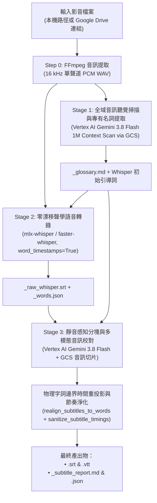

# Subtitle Craft — 影視級 AI 智慧字幕生成與校對套件

[English (en)](README.md) | [繁體中文 (zh-TW)](README.zh-TW.md) | [简体中文 (zh-CN)](README.zh-CN.md) | [日本語 (ja)](README.ja.md) | [한국어 (ko)](README.ko.md)

---

> [!IMPORTANT]
> **Google Antigravity 原生技能與工作流套件**  
> 本工具組為 **Google Antigravity**（由 **Vertex AI Gemini 3.8 Flash** 與 **Whisper 毫秒級詞級時間戳** 驅動）打造的獨立三階段 YouTube / Netflix 影視級字幕生成與品質審核套件。

---

**Subtitle Craft** 支援將本機或 Google Drive 影片與音訊檔案轉換為毫秒級精準對齊、專有名詞統一的 `.srt` 與 `.vtt` 字幕。可直接於 Antigravity 對話視窗以自然語言下達指令，或透過終端機 CLI 獨立執行。

---

## 安裝與 Google Cloud 環境設定 (`setup.sh`)

本專案符合 [Agent Plugins 1.0](https://agent-plugins.org/) 規範，全程基於 **Google Cloud Vertex AI (ADC)** 與 **Cloud Storage (GCS)** 運作，免除管理 API Key。

### 1. 安裝為 Antigravity Plugin 或 Skill

- **全域 Plugin（建議）**：
  ```bash
  git clone https://github.com/sylphlin/subtitle-craft.git ~/.gemini/config/plugins/subtitle-craft
  ```
- **全域 Skill**：
  ```bash
  git clone https://github.com/sylphlin/subtitle-craft.git ~/.gemini/config/skills/subtitle-craft
  ```

### 2. 安裝相依套件與一鍵配置雲端環境 (`setup.sh`)

```bash
# 1. 安裝 FFmpeg 與 Python 套件
brew install ffmpeg
pip install -r requirements.txt

# 2. 授權 Google Cloud ADC 憑證
gcloud auth application-default login

# 3. 執行 setup.sh 自動配置 GCS 儲存桶、雙層生命週期規則（raw: 2 天、產出物: 15 天）、IAM 與 .env
chmod +x setup.sh
./setup.sh --project YOUR_GCP_PROJECT_ID
```

### 專案目錄結構（Agent Plugins 1.0 標準規範）
```text
subtitle-craft/
├── plugin.json                                     # Agent Plugins 1.0 宣告清單
├── rules/
│   └── AGENTS.md                                   # 打包於 Plugin 內的客戶端執行期守則（唯讀、直接呼叫 CLI 與 Fail-Fast）
├── skills/
│   └── subtitle-craft/                             # 標準技能套件主幹（Single Source of Truth）
│       ├── SKILL.md                                # 技能規範與三階段自動化執行手冊
│       ├── scripts/                                # 核心執行腳本與模組實體目錄 (SSOT)
│       │   ├── generate_subtitles.py               # 三階段黃金字幕管線與 8 維度品質審核主程式
│       │   └── modules/                            # Vertex AI (llm_client)、GCS/Drive (gcp_client) 與進度條模組
│       └── assets/                                 # 多語系字幕校對提示詞範本實體目錄 (SSOT)
│           └── subtitle_proofread_template.*.md    # 支援 zh-TW, zh-CN, en, ja, ko 之 YouTube/Netflix 斷句規範
├── SKILL.md -> skills/subtitle-craft/SKILL.md      # 根目錄 POSIX Symlink
├── scripts -> skills/subtitle-craft/scripts        # 根目錄 POSIX Symlink（供 CLI 與測試直接引用）
├── assets -> skills/subtitle-craft/assets          # 根目錄 POSIX Symlink
├── subtitle_craft.py                               # 根目錄 CLI 執行入口
├── AGENTS.md                                       # 工作區與開發工程規範（Part I 執行守則 & Part II 開發規範）
├── setup.sh                                        # 原生 gcloud 雲端環境一鍵配置腳本
├── pyproject.toml                                  # Python 套件定義與 CLI 入口設定
├── requirements.txt                                # Python 相依套件清單
├── .env.example                                    # Vertex AI (ADC) 與 GCS 環境變數範本
└── tests/                                          # 離線單元測試套件
```

---

## 三階段黃金字幕管線架構



---

## 核心功能與 CLI 指令

### 1. 標準字幕生成（全自動三階段管線）
結合 **Stage 1（Vertex AI 1M 全域詞彙表與 Whisper 初始引導詞）**、**Stage 2（Whisper 毫秒級逐字時間戳）** 與 **Stage 3（靜音感知分塊、多模態音訊校對與 8 維度串流品質審核）**：

```bash
python3 subtitle_craft.py -i output/final_cut.mp4 --language zh-TW
```

### 2. 結合訪綱 (`--outline`) 或錄音講稿 (`--script`) 強化校對
提供訪談大綱、人名清單或錄音原稿，確保全片專有名詞、外來語及同音字 100% 精準一致：

```bash
python3 subtitle_craft.py \
  -i output/final_cut.mp4 \
  --outline outline.md \
  --script script.md \
  --language zh-TW
```

### 3. 直接輸入 Google Drive 分享連結
支援直接傳入 Google Drive 檔案連結（自動驗證遠端 `md5Checksum` 並快取於本機）：

```bash
python3 subtitle_craft.py -i "https://drive.google.com/file/d/FILE_ID/view" --language zh-TW
```

---

## GCS 雙層生命週期規則 (`gs://subtitle-craft-${PROJECT_ID}`)

| GCS 路徑前綴 (`matchesPrefix`) | 儲存內容 | 保留天數 (`age`) | 清理機制 |
| :--- | :--- | :--- | :--- |
| **`raw/audio_chunks/`** | Stage 3 音訊切片 | **推論後立即刪除** | 每個區塊完成後於 Python `finally` 立即刪除。 |
| **`raw/`** | 暫存完整音軌 | **2 天 (`age: 2`)** | 保留 2 天供 SHA-256 快取重用，期滿自動刪除。 |
| **`output/`**、**`deliverables/`** | SRT/VTT 字幕與審核報告 | **15 天 (`age: 15`)** | 保留 15 天供團隊下載與審閱，期滿自動清理。 |

---

## 授權條款 (License)

本專案採用 [MIT License](LICENSE) 授權。
