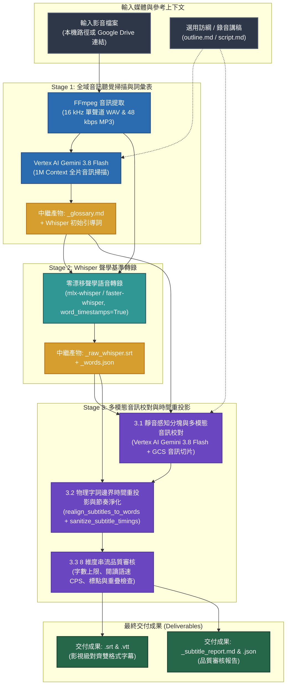

# Subtitle Craft — 影視級 AI 智慧字幕生成與校對套件

[English (en)](README.md) | [繁體中文 (zh-TW)](README.zh-TW.md) | [简体中文 (zh-CN)](README.zh-CN.md) | [日本語 (ja)](README.ja.md) | [한국어 (ko)](README.ko.md)

---

> [!IMPORTANT]
> **Google Antigravity 原生技能與工作流套件**  
> 本工具組為 **Google Antigravity**（由 **Vertex AI Gemini 3.8 Flash** 與 **Whisper 毫秒級詞級時間戳** 驅動）打造的獨立三階段 YouTube / Netflix 影視級字幕生成與品質審核套件。

---

**Subtitle Craft** 支援將本機或 Google Drive 影片與音訊檔案轉換為毫秒級精準對齊、專有名詞統一的 `.srt` 與 `.vtt` 字幕。直接於 Antigravity 對話視窗以自然語言下達指令，即可由 Agent 自動完成全流程字幕產製與品質審核。

---

## 安裝與 Google Cloud 環境設定 (`setup.sh`)

本專案符合 [Agent Plugins 1.0](https://agent-plugins.org/) 規範，全程基於 **Google Cloud Vertex AI (ADC)** 與 **Cloud Storage (GCS)** 運作，免除管理 API Key。

### 1. 安裝為 Antigravity Plugin 或 Skill

- **全域 Plugin（建議）**：
  ```bash
  git clone https://github.com/sylphlin/subtitle-craft.git ~/.gemini/config/plugins/subtitle-craft
  ```
- **舊式單一 Skill 安裝（`~/.gemini/config/skills/`）**：
  將儲存庫內的 `skills/subtitle-craft` 子目錄連結至舊版 Skills 目錄：
  ```bash
  git clone https://github.com/sylphlin/subtitle-craft.git ~/.gemini/config/plugins/subtitle-craft
  ln -s ~/.gemini/config/plugins/subtitle-craft/skills/subtitle-craft ~/.gemini/config/skills/subtitle-craft
  ```

### 2. 安裝相依套件與一鍵配置雲端環境 (`setup.sh`)

```bash
# 1. 安裝 FFmpeg 與 Python 套件
brew install ffmpeg
pip install -r requirements.txt

# 2. 授權 Google Cloud ADC 憑證
gcloud auth application-default login

# 3. 執行 setup.sh 自動配置 GCS 儲存桶、雙層生命週期規則（raw: 2 天、產出物: 15 天）、IAM 與 .env
chmod +x setup.sh
./setup.sh --project YOUR_GCP_PROJECT_ID
```

### 專案目錄結構（Agent Plugins 1.0 標準規範）
```text
subtitle-craft/
├── plugin.json                                     # Agent Plugins 1.0 宣告清單
├── rules/
│   └── AGENTS.md                                   # 打包於 Plugin 內的客戶端執行期守則（唯讀、直接呼叫 CLI 與 Fail-Fast）
├── skills/
│   └── subtitle-craft/                             # 標準技能套件主幹（Single Source of Truth）
│       ├── SKILL.md                                # 技能規範與三階段自動化執行手冊
│       ├── scripts/                                # 核心執行腳本與模組實體目錄 (SSOT)
│       │   ├── generate_subtitles.py               # 三階段黃金字幕管線與 8 維度品質審核主程式
│       │   └── modules/                            # Vertex AI (llm_client)、GCS/Drive (gcp_client) 與進度條模組
│       └── assets/                                 # 多語系字幕校對提示詞範本實體目錄 (SSOT)
│           └── subtitle_proofread_template.*.md    # 支援 zh-TW, zh-CN, en, ja, ko 之 YouTube/Netflix 斷句規範
├── AGENTS.md                                       # 工作區與開發工程規範（Part I 執行守則 & Part II 開發規範）
├── setup.sh                                        # 原生 gcloud 雲端環境一鍵配置腳本
├── pyproject.toml                                  # Python 套件定義與 CLI 入口設定
├── requirements.txt                                # Python 相依套件清單
├── .env.example                                    # Vertex AI (ADC) 與 GCS 環境變數範本
└── tests/                                          # 離線單元測試套件
```

---

## 三階段黃金字幕管線架構



---

## 使用情境與 Agent 指令範例 (User Scenarios & Agent Prompts)

### 情境 1：標準 YouTube 與 Netflix 影視級字幕生成
- **適用場景**：為影片或音訊自動生成毫秒級對齊的 `.srt` 與 `.vtt` 字幕，並校對同音字與技術專有名詞。
- **Agent 指令範例**：
  > *「幫我為 `output/final_cut.mp4` 產生繁體中文 YouTube 字幕，並校對技術專有名詞與同音字。」*
- **交付成果**：
  1. `final_cut.srt` 與 `final_cut.vtt`（符合串流閱讀節奏的雙格式字幕）。
  2. `final_cut_glossary.md`（全片專有名詞與講者對照表）。
  3. `final_cut_subtitle_report.md` 與 `final_cut_subtitle_report.json`（8 維度串流品質審核報告）。

### 情境 2：結合訪綱或錄音講稿強化專有名詞一致性
- **適用場景**：提供訪談大綱、人名清單或錄音文稿，確保全片人名、品牌與領域術語 100% 精準一致。
- **Agent 指令範例**：
  > *「請參考 `outline.md` 與 `script.md` 的專有名詞，幫 `interview.mp4` 產生並校對繁體中文字幕。」*
- **交付成果**：
  1. `interview.srt` 與 `interview.vtt`（依據訪綱與講稿完成術語鎖定之字幕）。
  2. `interview_glossary.md`、`interview_subtitle_report.md` 與 `interview_subtitle_report.json`。

### 情境 3：直接從 Google Drive 分享連結產生字幕
- **適用場景**：直接傳入 Google Drive 影片或音訊連結，由 Agent 自動下載（支援遠端 MD5 快取驗證）並完成字幕產製。
- **Agent 指令範例**：
  > *「幫這個 Google Drive 影片 `https://drive.google.com/file/d/FILE_ID/view` 產生繁體中文雙格式字幕與品質審核報告。」*
- **交付成果**：
  1. `<影片名稱>.srt` 與 `<影片名稱>.vtt`。
  2. `<影片名稱>_glossary.md`、`<影片名稱>_subtitle_report.md` 與 `<影片名稱>_subtitle_report.json`。

---

## 三階段核心技術說明 (v2.0 架構升級)

- **輸出目錄自動隔離（`<input_dir>/output/`）**：未指定 `-o` / `--output-dir` 時，系統預設將所有最終與中繼產物（`.srt`、`.vtt`、`_glossary.md`、`_raw_whisper.srt`、`_words.json`、`_subtitle_report.md`、`_subtitle_report.json`）收納於 `<input_dir>/output/` 子目錄；若輸入檔案已位於 `output/` 目錄下則直接重用，避免產生 `output/output/` 巢狀結構。
1. **Stage 1（全域音訊聽覺掃描與詞彙表提取 — 嚴格 Fail-Fast）**：將全片音訊壓縮並上傳至 `gs://subtitle-craft-${PROJECT_ID}/raw/`，透過 **Vertex AI Gemini 3.8 Flash**（`1M` Context）產出 `<basename>_glossary.md` 與對應語系的 Whisper 初始引導詞（$\le 145$ 字元）。若發生雲端權限或連線錯誤，立即以狀態碼 `1` 終止並輸出診斷步驟，絕不靜默降級。
2. **Stage 2（Whisper 毫秒級逐字聲學時間戳 — 預設 `small` 模型）**：預設採用 `--whisper-model small` 執行 `mlx-whisper`（Apple Silicon Metal 加速）或 `faster-whisper`（`word_timestamps=True`），提取高精準度物理字詞邊界並快取為 `<basename>_raw_whisper.srt` 與 `<basename>_words.json`。
3. **Stage 3（靜音感知分塊、非連鎖防漂移聲學重投影與 `agent_verdict` 品質閘門）**：
   - 於自然換氣停頓處（$\ge 0.4\text{s}$）切分區塊，比對音訊切片與全域詞彙表修正同音字（雲端錯誤立即取消佇列並以狀態碼 `1` 終止）。
   - **非連鎖防漂移重投影（`realign_subtitles_to_words`）**：採用雙向彈性字元搜尋視窗（`cur_char_idx - 15` 回溯容錯）、保守退避推進（`+ L` 字元）、重同步錨點（`cur_char_idx = m_end + 1`）與 `source_bounds` 邊界夾制，確保單行退避絕不引發後續字幕連鎖時間漂移；並於語音結束後保留 $+0.4\text{s}$ 閱讀尾韻緩衝（上限鎖定於 `media_duration + 0.4s`）。
   - **8 維度串流品質審核與 `agent_verdict` 機器可讀閘門**：於 `<basename>_subtitle_report.json` 頂層寫入 `agent_verdict`（檢核 `acoustic_lock_rate_pct >= 80.0%`、`last_out_vs_duration_diff_sec <= 0.5s` 與零重疊）。搭配 `--strict` 參數時，若未通過品質閘門將回傳退出碼 `2`，支援 AI Agent 執行最多 1 次自動重試修復（`--whisper-model small --force`）。

---

## GCS 雙層生命週期規則 (`gs://subtitle-craft-${PROJECT_ID}`)

| GCS 路徑前綴 (`matchesPrefix`) | 儲存內容 | 保留天數 (`age`) | 清理機制 |
| :--- | :--- | :--- | :--- |
| **`raw/audio_chunks/`** | Stage 3 音訊切片 | **推論後立即刪除** | 每個區塊完成後於 Python `finally` 立即刪除。 |
| **`raw/`** | 暫存完整音軌 | **2 天 (`age: 2`)** | 保留 2 天供 SHA-256 快取重用，期滿自動刪除。 |
| **`output/`**、**`deliverables/`** | SRT/VTT 字幕與審核報告 | **15 天 (`age: 15`)** | 保留 15 天供團隊下載與審閱，期滿自動清理。 |

---

## 授權條款 (License)

本專案採用 [MIT License](LICENSE) 授權。
